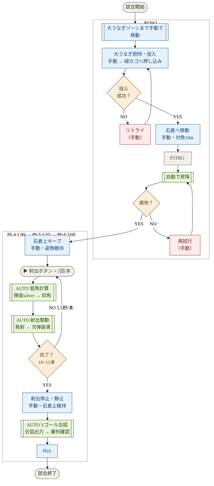

```mermaid
%%{init: {'theme': 'base', 'themeVariables': {'primaryColor': '#ffffff', 'primaryTextColor': '#000000', 'primaryBorderColor': '#000000', 'lineColor': '#333333', 'secondaryColor': '#ffffff', 'tertiaryColor': '#ffffff', 'mainBkg': '#ffffff', 'nodeBorder': '#000000', 'clusterBkg': '#ffffff', 'clusterBorder': '#999999', 'edgeLabelBackground': '#ffffff', 'fontFamily': 'sans-serif'}, 'flowchart': {'nodeSpacing': 18, 'rankSpacing': 25, 'padding': 10}}}%%

flowchart TD
    START([試合開始])

    subgraph ROW1
        direction LR

        P1[["大うなぎゾーンまで手動で移動"]]
        P2["大うなぎ把持・投入\n手動 → 緑カゴへ押し込み"]
        P2C{"投入\n成功？"}
        P2R["リトライ\n（手動）"]
        P3A["石倉へ移動\n手動・対角10m"]
        P3AUTO[["自動で昇降"]]
        P3CHK{"接地？"}
        P3R["再試行\n（手動）"]

        P1 --> P2 --> P2C
        P2C -- YES --> P3A
        P2C -- NO --> P2R --> P2
        P3A --> P3TRG --> P3AUTO --> P3CHK
        P3CHK -- NO --> P3R --> P3AUTO
    end

    subgraph ROW2["Ph.4 1:00 → Ph.5 1:55 → Ph.6 2:00"]
        direction LR

        P4A["石倉上キープ\n手動・姿勢維持"]
        P4TRG(["▶ 射出ボタン × 1回/本"])
        P4CALC[["AUTO 狙角計算\n弾道solver → 仰角"]]
        P4SHOT[["AUTO 射出駆動\n発射 → 次弾装填"]]
        P4CNT{"完了？\n10~12本"}
        P5A["射出停止・静止\n手動・石倉上維持"]
        P5AUTO[["AUTO Vゴール合図\n合図出力 → 審判確認"]]

        P4A --> P4TRG --> P4CALC --> P4SHOT --> P4CNT
        P4CNT -- "NO 5.5秒/本" --> P4TRG
        P4CNT -- YES --> P5A --> P5AUTO --> P6A
    end

    END([試合終了])

    START --> P1
    P3CHK -- YES --> P4A
    P6A --> END

    classDef manual  fill:#E6F1FB,stroke:#185FA5,color:#0C447C
    classDef auto    fill:#EAF3DE,stroke:#3B6D11,color:#27500A
    classDef trigger fill:#F1EFE8,stroke:#5F5E5A,color:#444441
    classDef judge   fill:#FAEEDA,stroke:#854F0B,color:#633806
    classDef retry   fill:#FCEBEB,stroke:#A32D2D,color:#791F1F
    classDef term    fill:#F1EFE8,stroke:#5F5E5A,color:#2C2C2A

    class P1,P2,P3A,P4A,P5A,P6A manual
    class P3AUTO,P4CALC,P4SHOT,P5AUTO auto
    class P3TRG,P4TRG trigger
    class P2C,P3CHK,P4CNT judge
    class P2R,P3R retry
    class START,END term
```
